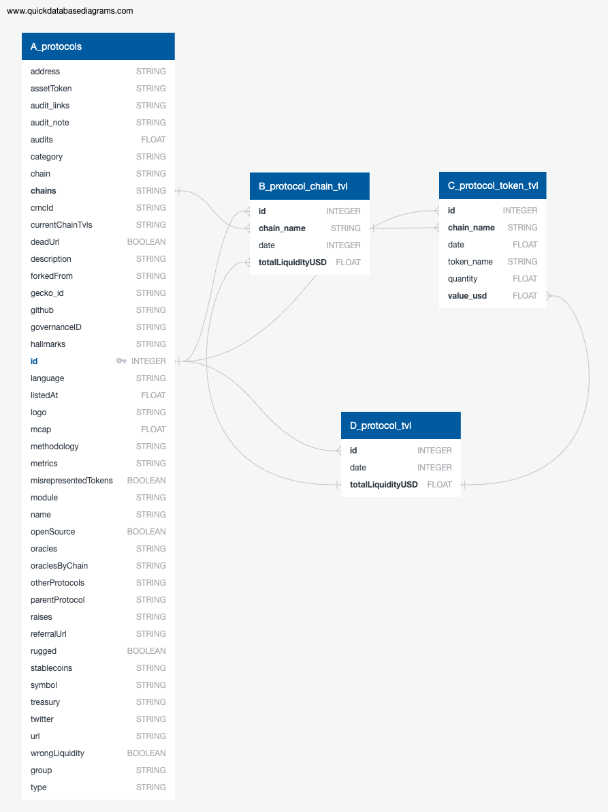

# defi-tvl

## Overview
This project aims to analyze and process data related to Total Value Locked (TVL) in various blockchain protocols. The primary data sources are CoinMetrics and DefiLlama. The project has evolved from utilizing extracted CSV files to directly querying data from Google BigQuery for a more efficient and streamlined analysis.

## Introduction
- **Data Sources**:
  - **CoinMetrics**: The data from CoinMetrics was found to lack granularity, making it less suitable for detailed analysis.
  - **DefiLlama**: DefiLlama data proved to be a valuable resource:
    - Request cap and rate limiting are well-suited for this project's needs.
    - Data frequency for TVL and tokens is available in both daily and minute intervals.
    
- **ETL for Granular Data**:
  - An ETL (Extract, Transform, Load) process is established using Google Cloud Services and Google BigQuery.
  - Data is organized into tables:
    - $A$: `protocols`: Contains metadata for each protocol.
    - $B$: `protocol_chain_tvl`: Details a protocol's TVL, separated by chain.
    - $C$: `protocol_token_tvl`: Details a protocol's TVL, separated by token.
    - $D$: `protocol_tvl`: Aggregates a protocol's TVL.
    - $E$: `chain_ndc_tvl`: Non-double counted TVL by chain.

- **Table Relations**
  - $\mathbf{z} = \{z_1, z_2, \dots\}$: Protocols.
  - $\mathbf{x} = \{x_1, x_2, \dots\}$: Chains related to a protocol.
  - $\mathbf{y} = \{y_1, y_2, \dots\}$: Tokens associated with a protocol.
  - $\mathbb{T} = \{t_1, t_2, \dots\}$: All time points.
  - $f_B: \mathbf{z} \times \mathbf{x} \times \mathbb{T} \rightarrow \mathbb{R}$: Function mapping a protocol, chain, and time point to the TVL in table $B$.
  - $f_C: \mathbf{z} \times \mathbf{y} \times \mathbb{T} \rightarrow \mathbb{R}$: Function mapping a protocol, token, and time point to the TVL in table $C$.
  - $f_D: \mathbf{z} \times \mathbb{T} \rightarrow \mathbb{R}$: Function mapping a protocol and time point to the total aggregated TVL in table $D$.
  - $f_E: \mathbf{x} \times \mathbb{T} \rightarrow \mathbb{R}$: Function mapping a chain and time point to the non-double counted TVL in table $E$.
  - At any time point $t \in \mathbb{T}$, the total TVL $f_D(z_i, t)$ for a protocol $z_i$ is given by:
    - $f_D(z_i, t) = \sum f_B(z_i, x, t) = \sum f_C(z_i, y, t)$
    - Where the summations are over all $x$ in $\mathbf{x}$ and all $y$ in $\mathbf{y}$.
    - This equation assumes that the total TVL for a protocol at a given time point can be fully represented by either the sum of the TVLs across all chains or the sum of the TVLs across all tokens. It's important to note that this kind of aggregation assumes no overlap or double-counting between the chains and tokens; otherwise, the sums might not be equivalent.

## How to Use
Online access to Google BigQuery is necessary. 

[Link to visualization app](https://defi-tvl.streamlit.app/)

## Contributing
Feel free to open an issue or create a pull request.

## License
TBD.
